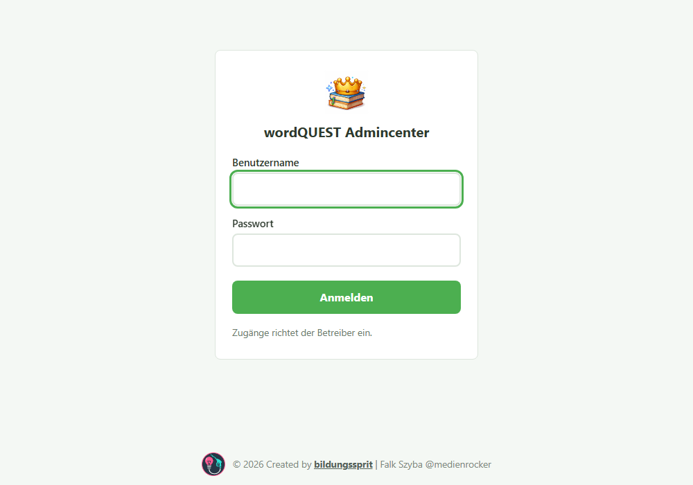
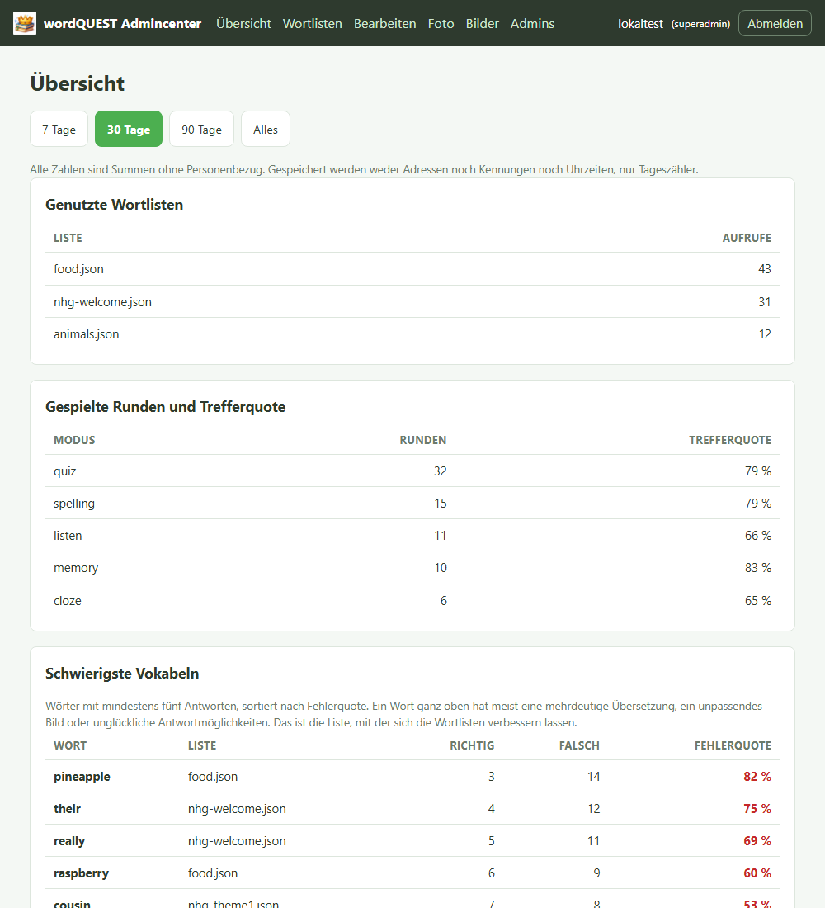
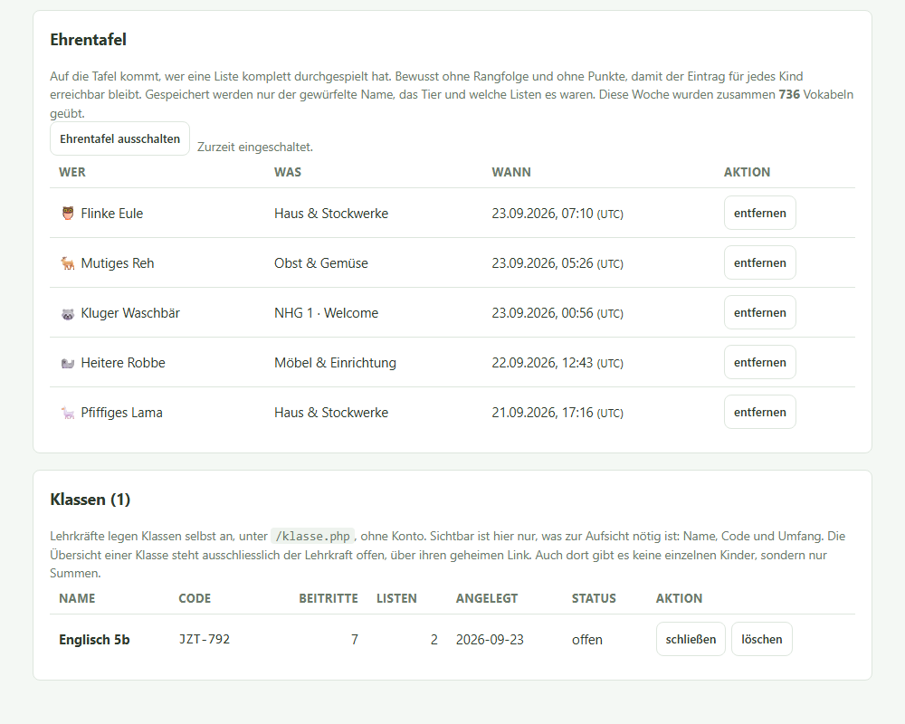
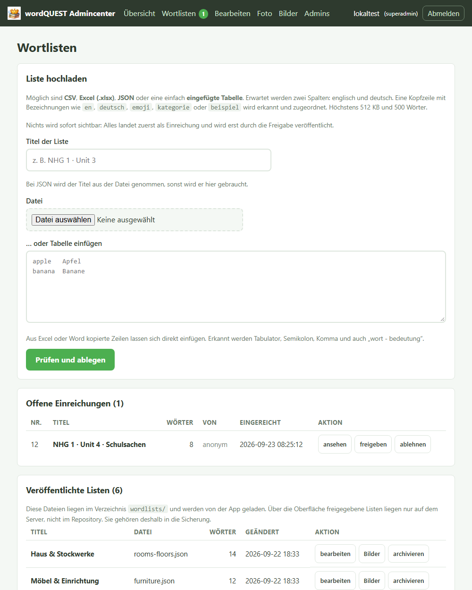
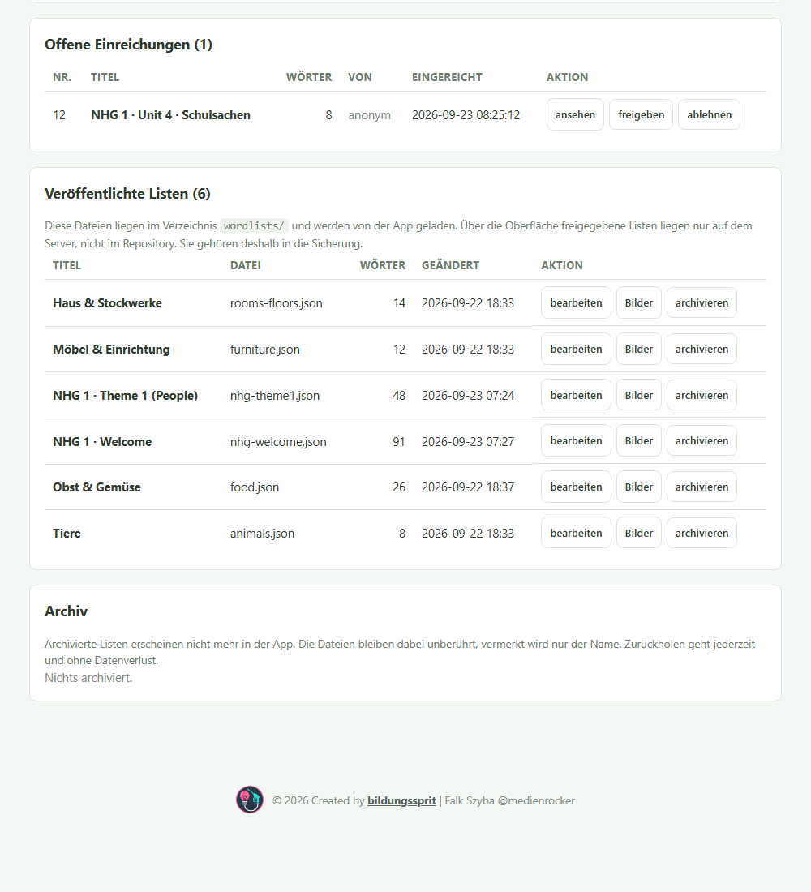
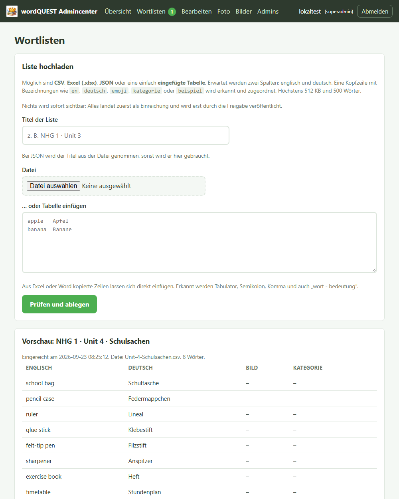
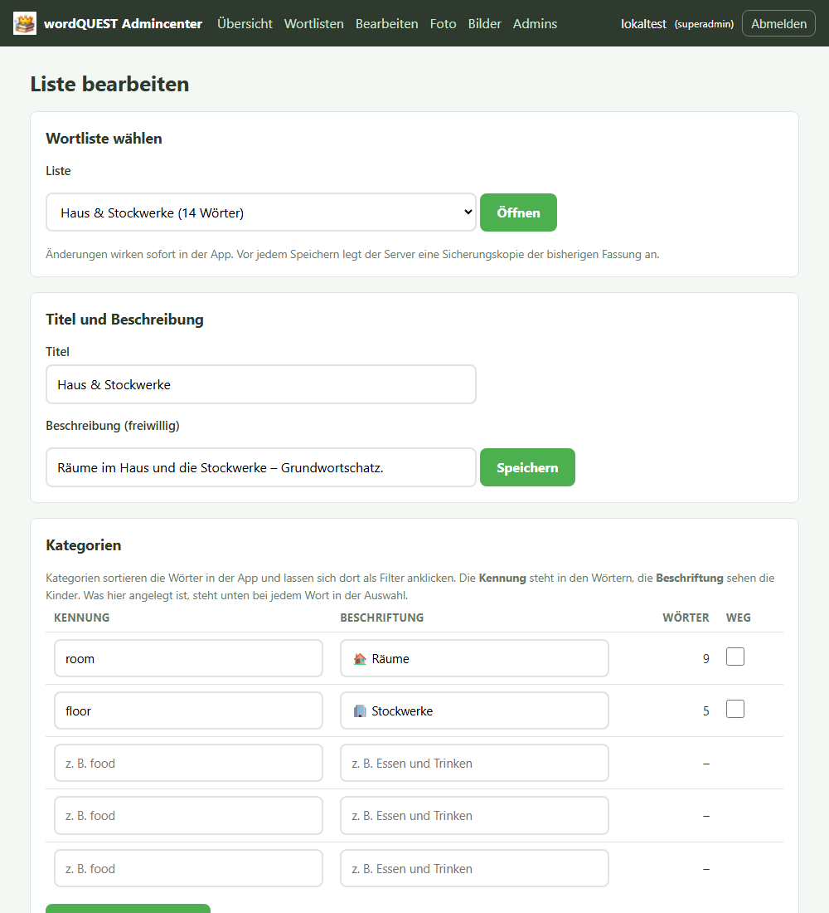
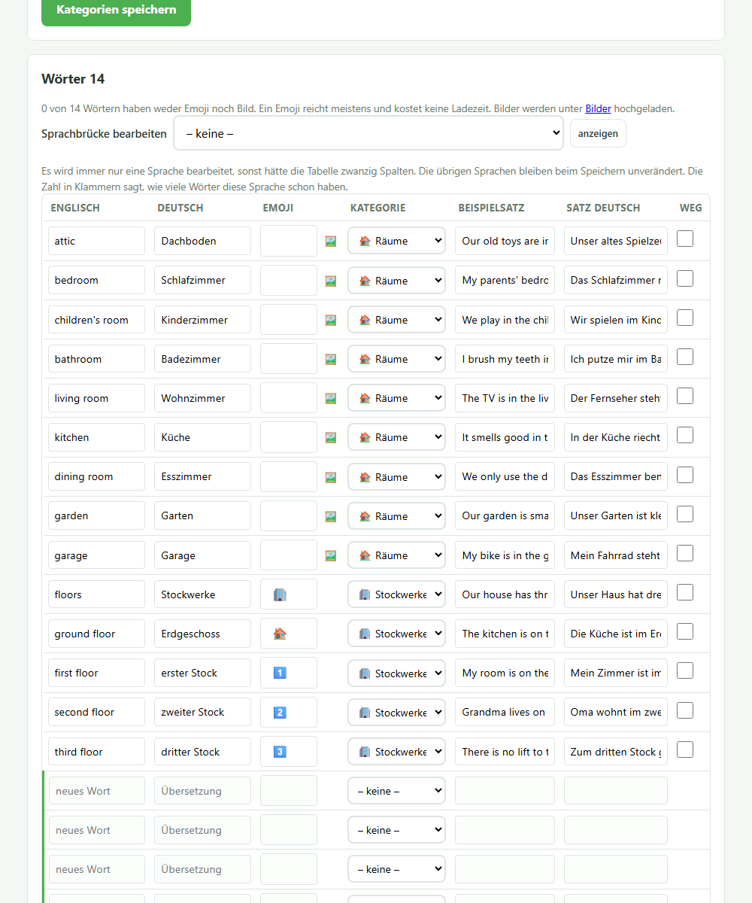
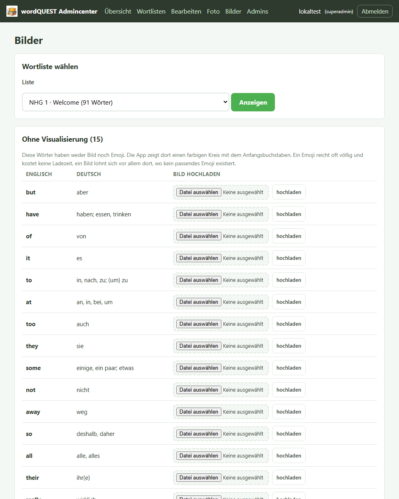
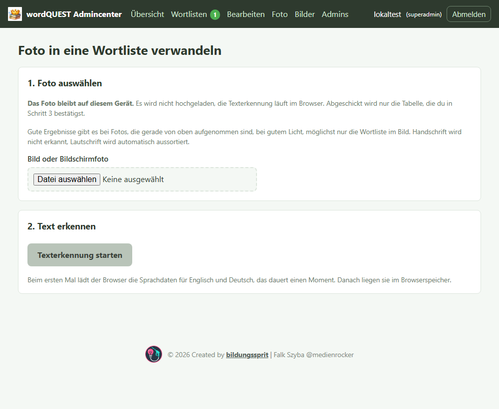

# wordQUEST, Admincenter

Diese Anleitung beschreibt die tägliche Arbeit im Admincenter: Einreichungen
freigeben, Wortlisten pflegen, Bilder zuordnen, Nutzung im Blick behalten.

Nicht hier, sondern in eigenen Dokumenten:

- **Installation, Deploy, Serverpfade, erster Superadmin:** `docs/DEPLOY.md`
- **Sicherheitsentscheidungen und offene Punkte:** `docs/SECURITY.md`
- **Bildmaterial selbst erzeugen:** `docs/BILD-PROMPTS.md`

---

## 1. Anmelden

Das Admincenter liegt unter **/admin/**.

Es gibt keine Selbstregistrierung. Zugänge richtet ein Superadmin ein.
Das Passwort liegt als Argon2id-Hash in der Datenbank. Nach mehreren
Fehlversuchen sperrt sich ein Konto eine Zeit lang selbst.

**Zwei Rollen:**

| Rolle | Darf |
|---|---|
| **admin** | alles Fachliche: Listen, Bilder, Einreichungen, Übersicht |
| **superadmin** | zusätzlich Konten anlegen, sperren und löschen |

Der letzte aktive Superadmin lässt sich nicht entfernen.
Konten verwaltest du unter **Admins**.

---

## 2. Übersicht

Oben wählst du den Zeitraum: 7, 30, 90 Tage oder alles.

Alle Zahlen sind Summen ohne Personenbezug. Gespeichert werden weder
Adressen noch Kennungen noch Uhrzeiten, nur Tageszähler. Die Kinder können
die Zählung in der App außerdem abschalten.

**Genutzte Wortlisten** zeigt, was tatsächlich gebraucht wird.
Listen, die nie auftauchen, kannst du archivieren.

**Gespielte Runden und Trefferquote** zeigt je Spielmodus, wie gut es läuft.

**Schwierigste Vokabeln** ist die wichtigste Tabelle der Seite.
Ein Wort ganz oben hat meist eine mehrdeutige Übersetzung, ein unpassendes
Bild oder unglückliche Antwortmöglichkeiten. Das ist die Liste, mit der sich
die Wortlisten verbessern lassen.

**Ehrentafel:** Du kannst einzelne Einträge entfernen und die Tafel ganz
abschalten. Gespeichert werden nur der gewürfelte Name, das Tier und die
Liste.

**Klassen:** Lehrkräfte legen Klassen selbst an, unter `/klasse.php`, ohne
Konto. Sichtbar ist hier nur, was zur Aufsicht nötig ist: Name, Code und
Umfang. Die Auswertung einer Klasse steht ausschließlich der Lehrkraft offen,
über ihren geheimen Link. Du kannst eine Klasse schließen oder löschen.

---

## 3. Wortlisten

Die Seite hat fünf Abschnitte, von oben nach unten:

1. **Liste hochladen**
2. **Offene Einreichungen**
3. **Veröffentlichte Listen**
4. **Archiv**
5. **Abgelehnt**

### Liste hochladen

Möglich sind CSV, Excel (.xlsx), JSON oder eine einfach eingefügte Tabelle.
Erwartet werden zwei Spalten, englisch und deutsch. Eine Kopfzeile mit
Bezeichnungen wie `en`, `deutsch`, `emoji`, `kategorie` oder `beispiel` wird
erkannt und zugeordnet. Höchstens 512 KB und 500 Wörter.

**Nichts wird sofort sichtbar.** Auch was du selbst hochlädst, landet zuerst
als Einreichung und wird erst durch die Freigabe veröffentlicht.

### Einreichungen prüfen und freigeben

Zu jeder offenen Einreichung gibt es drei Knöpfe:

- **ansehen** zeigt die vollständige Vorschau mit allen Wörtern, Bildern und
  Kategorien.

- **freigeben** schreibt die Liste nach `wordlists/`. Sie ist danach sofort
  in der App.
- **ablehnen** verschiebt sie in den Abschnitt **Abgelehnt**.

Eine abgelehnte Einreichung ist nicht verloren. Ganz unten auf derselben
Seite steht sie unter **Abgelehnt** mit dem Knopf **zurückholen**. Danach
liegt sie wieder unter "Offene Einreichungen" und lässt sich freigeben.

### Veröffentlichte Listen

Je Liste gibt es **bearbeiten**, **Bilder** und **archivieren**.

**Archivieren** nimmt eine Liste aus der App, rührt die Datei aber nicht an.
Vermerkt wird nur der Name. Zurückholen geht jederzeit und ohne
Datenverlust. Erst **endgültig entfernen** löscht die Datei aus dem
Auslieferungsverzeichnis, und auch dann wird vorher eine Kopie abgelegt.

> **Wichtig für die Sicherung:** Über die Oberfläche freigegebene Listen
> liegen nur auf dem Server, nicht im Repository. Dasselbe gilt für
> hochgeladene Bilder. Beides gehört in die Datensicherung.
> Welche Verzeichnisse das genau sind, steht in `docs/DEPLOY.md`.

---

## 4. Eine Liste bearbeiten

Änderungen wirken **sofort in der App**. Vor jedem Speichern legt der Server
automatisch eine Sicherungskopie der bisherigen Fassung an. Ganz unten auf
der Seite steht **Frühere Fassungen**, dort holst du eine davon zurück.
Behalten werden die letzten zwölf.

### Titel und Beschreibung

Der Titel steht in der Wortlistenauswahl, die Beschreibung darunter.
Beides sehen die Kinder.

### Kategorien

Kategorien sortieren die Wörter in der App und lassen sich dort als Filter
anklicken. Die **Kennung** steht technisch in den Wörtern, zum Beispiel
`room`. Die **Beschriftung** sehen die Kinder, zum Beispiel "🏠 Räume".
Leere Zeilen am Ende sind Platz für neue Kategorien.

### Wörter

Die Tabelle zeigt 40 Wörter je Seite. Spalten sind Englisch, Deutsch, Emoji,
Kategorie, Beispielsatz und die deutsche Fassung des Satzes.

- Das Häkchen **weg** entfernt ein Wort beim Speichern.
  Verklickt? Nicht speichern, sondern die Seite neu laden. Oder nach dem
  Speichern die vorige Fassung unter "Frühere Fassungen" zurückholen.
- Die leeren Zeilen unten sind für neue Wörter.
- Ein Emoji reicht meistens und kostet keine Ladezeit. Ein Bild lohnt sich
  vor allem dort, wo kein passendes Emoji existiert.

**Sprachbrücke:** Es wird immer nur **eine** Zusatzsprache zugleich
bearbeitet, sonst hätte die Tabelle zwanzig Spalten. Wähle oben die Sprache
und klicke auf "anzeigen". Die übrigen Sprachen bleiben beim Speichern
unverändert. Die Zahl in Klammern sagt, wie viele Wörter diese Sprache schon
haben.

---

## 5. Bilder

Wähle oben eine Wortliste. Die Seite zeigt dann drei Abschnitte:

**Ohne Visualisierung** listet die Wörter, die weder Bild noch Emoji haben.
Die App zeigt dort einen farbigen Kreis mit dem Anfangsbuchstaben. Je Zeile
kannst du direkt eine Datei auswählen und hochladen.

**Mit Bild** zeigt die bereits zugeordneten Bilder. **Zuordnung lösen**
entfernt die Verknüpfung, die Datei bleibt liegen.

**Abgelegte Bilddateien** listet alles Hochgeladene. Löschen lässt sich nur,
worauf keine Liste mehr zeigt.

### Was beim Hochladen passiert

- Angenommen werden höchstens 6 MB und 40 Megapixel.
- Jedes Bild wird auf höchstens **256 Pixel Kantenlänge** verkleinert und als
  **WebP** gespeichert. Das ist die Größe, in der die App es anzeigt.
- Ist der Hintergrund fast, aber nicht ganz weiß, wird er auf reines Weiß
  gezogen. So passen Bilder aus verschiedenen Quellen optisch zusammen.
  Bilder mit dunklem Grund oder Verlauf bleiben unangetastet.

Gute Bildmotive entstehen nicht von selbst. `docs/BILD-PROMPTS.md` enthält
fertige Prompts, mit denen sich passende Bilder erzeugen lassen.

---

## 6. Foto in eine Wortliste verwandeln

Für den Fall, dass eine Vokabelliste nur auf Papier existiert.

**Das Foto bleibt auf dem Gerät.** Es wird nicht hochgeladen, die
Texterkennung läuft vollständig im Browser. Abgeschickt wird nur die
Tabelle, die du in Schritt 3 bestätigst. Sie geht dann durch denselben
Einreichungsweg wie eine von Hand eingefügte Tabelle.

Drei Schritte:

1. **Foto auswählen.** Gerade von oben aufgenommen, gutes Licht, möglichst
   nur die Wortliste im Bild. Handschrift wird nicht erkannt, Lautschrift
   wird automatisch aussortiert. Bildschirmfotos gehen auch, dunkle werden
   automatisch erkannt und umgedreht.
2. **Texterkennung starten.** Beim ersten Mal lädt der Browser die
   Sprachdaten für Englisch und Deutsch, das dauert einen Moment. Danach
   liegen sie im Browserspeicher.
3. **Durchsehen und übernehmen.** Die Erkennung macht Fehler, das ist normal.
   Jede Zeile prüfen, falsche entfernen, den Rest korrigieren.

Diese Seite ist die einzige im Admincenter, die JavaScript braucht, und
bekommt deshalb eine eigene, eng gefasste Sicherheitsrichtlinie. Alle
anderen Seiten laufen ohne Skripte.

---

## 7. Wiederkehrende Aufgaben

| Wann | Was |
|---|---|
| **Bei jeder Einreichung** | ansehen, dann freigeben oder ablehnen. Abgelehntes bleibt zurückholbar. |
| **Monatlich** | "Schwierigste Vokabeln" durchgehen. Ein Wort ganz oben hat meist ein inhaltliches Problem, kein Lernproblem. |
| **Monatlich** | "Ohne Visualisierung" je Liste prüfen. Emoji reicht oft. |
| **Nach jedem Deploy** | Prüfliste in `docs/DEPLOY.md` abarbeiten. |
| **Regelmäßig** | Sicherung. Freigegebene Listen, hochgeladene Bilder und die Datenbank liegen nicht im Repository. |

---

## 8. Wenn etwas nicht stimmt

**Eine Liste ist versehentlich weg.**
Erst im **Archiv** nachsehen, dort steht "zurückholen". War es eine Änderung
im Editor, hilft **Frühere Fassungen** unten auf der Bearbeitungsseite.

**Eine Einreichung wurde versehentlich abgelehnt.**
Abschnitt **Abgelehnt** ganz unten auf der Seite Wortlisten, Knopf
**zurückholen**.

**Wörter wurden versehentlich mit "weg" markiert und gespeichert.**
**Frühere Fassungen**, die vorige Fassung zurückholen.

**Die App zeigt eine alte Fassung.**
Der Service Worker liefert die Oberfläche aus dem Cache. Wortlisten kommen
dagegen immer zuerst aus dem Netz. Wenn die Oberfläche alt aussieht, wurde
beim Deploy die Cache-Version nicht hochgezählt. Siehe `docs/DEPLOY.md`.

**Die Anmeldung klappt nicht.**
Siehe `docs/DEPLOY.md`, Abschnitt "Anmeldung klappt nicht?".
