# wordQUEST: So geht das

Eine Anleitung für dich.

wordQUEST ist eine App zum Vokabeln lernen. Du brauchst kein Konto.
Du musst dich nirgends anmelden. Du gibst keinen Namen ein.
Alles, was du lernst, bleibt auf deinem Gerät.

---

## 1. Die App öffnen

Gib im Browser diese Adresse ein:

**wordquest.bildungssprit.de**

Fertig. Die App startet sofort.

**Tipp:** Du kannst wordQUEST wie eine echte App auf den Startbildschirm legen.
Tippe im Browser auf das Menü mit den drei Punkten und dann auf
"Zum Startbildschirm hinzufügen". Danach findest du wordQUEST bei deinen
anderen Apps. Es funktioniert dann auch ohne Internet.

---

## 2. Der Startbildschirm

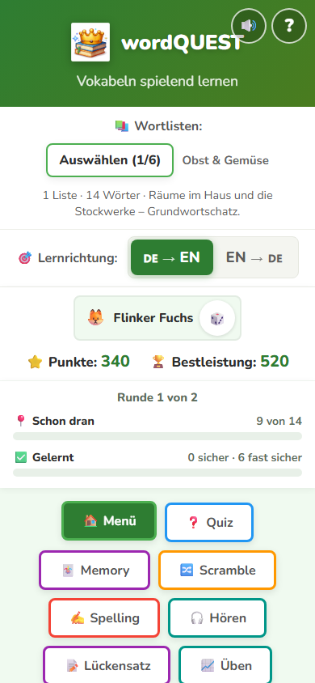

Von oben nach unten siehst du das:

**Der Lautsprecher 🔊**
Schaltet die Aussprache an und aus. Wenn er an ist, kannst du dir englische
Wörter vorlesen lassen.

**Das Fragezeichen ?**
Erklärt dir alle Knöpfe und alle Balken. Wenn du etwas nicht verstehst,
tippe hier.

**Wortlisten**
Hier stehen die Wörter, die du gerade lernst. Mit **Auswählen** suchst du
andere aus.

**Lernrichtung**
**DE → EN** heißt: Du siehst Deutsch und sollst Englisch antworten.
**EN → DE** ist andersherum. Tippe darauf, um zu wechseln.

**Dein Name**
Du bekommst einen Namen geschenkt, zum Beispiel "Flinker Fuchs".
Tippe auf den Würfel daneben, dann bekommst du einen neuen.
Dein echter Name steht nirgends. Das ist Absicht.

**Punkte und Bestleistung**
Punkte sammelst du beim Spielen. Die Bestleistung ist dein eigener Rekord.
Du spielst nur gegen dich selbst, nie gegen andere Kinder.

**Die zwei Balken**
Der blaue Balken zeigt, wie viele Wörter schon einmal dran waren.
Der grüne Balken zeigt, wie viele du schon sicher kannst.

---

## 3. Deine Wörter aussuchen

Tippe oben auf **Auswählen**.

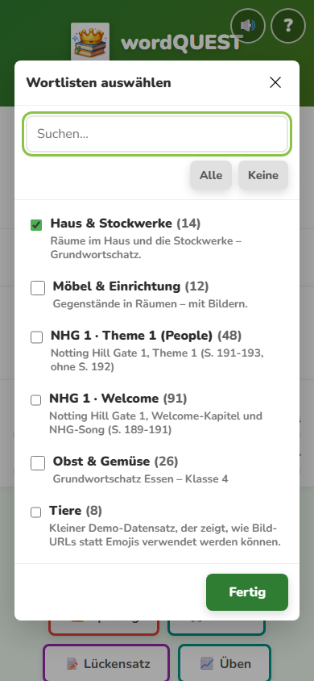

Setze bei jeder Liste ein Häkchen, die du üben willst.
Du kannst auch mehrere gleichzeitig nehmen.
Unten tippst du auf **Fertig**.

Wenn deine Lehrkraft dir einen Code gegeben hat, musst du hier gar nichts
auswählen. Der Code stellt die Listen von selbst ein.
Wie das geht, steht in Kapitel 9.

---

## 4. Die neun Spiele

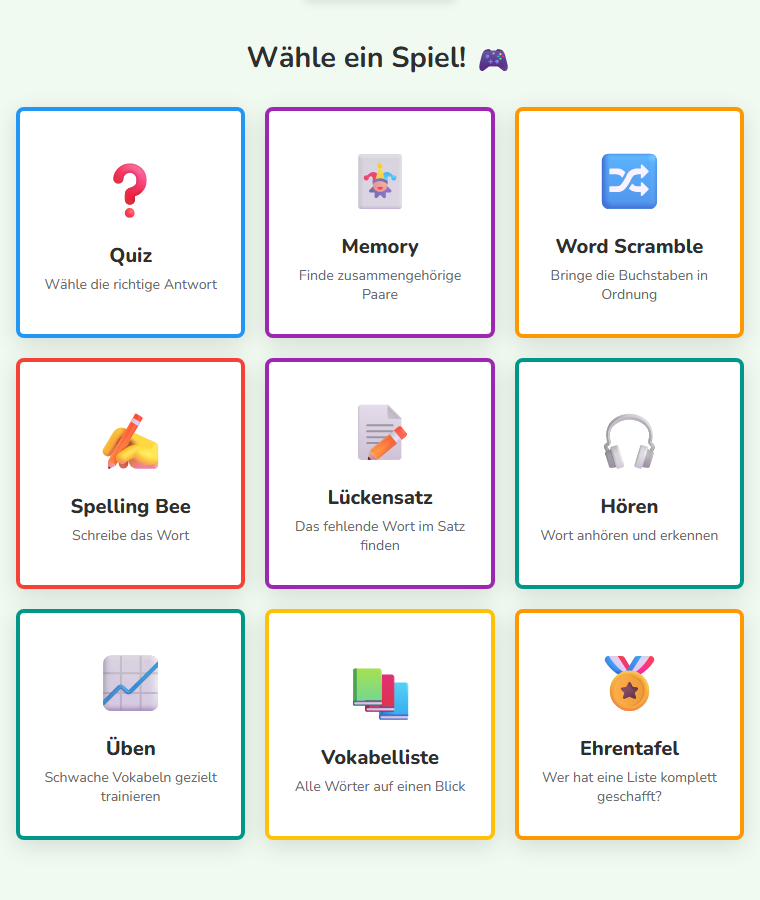

| Spiel | Was du tust |
|---|---|
| **Quiz** | Du wählst die richtige Antwort aus. |
| **Memory** | Du findest Paare, die zusammengehören. |
| **Word Scramble** | Die Buchstaben sind durcheinander. Du bringst sie in Ordnung. |
| **Spelling Bee** | Du schreibst das Wort selbst. |
| **Lückensatz** | In einem Satz fehlt ein Wort. Du findest es. |
| **Hören** | Du hörst ein Wort und erkennst es. |
| **Üben** | Du übst genau die Wörter, die dir schwerfallen. |
| **Vokabelliste** | Alle Wörter auf einen Blick, zum Nachschauen. |
| **Ehrentafel** | Wer hat eine Liste ganz geschafft? |

Manche Spiele erscheinen erst, wenn deine Liste dazu passt.
**Hören** gibt es nur, wenn dein Gerät Englisch sprechen kann.
**Lückensatz** gibt es nur, wenn zu den Wörtern Beispielsätze da sind.

---

## 5. Das Quiz

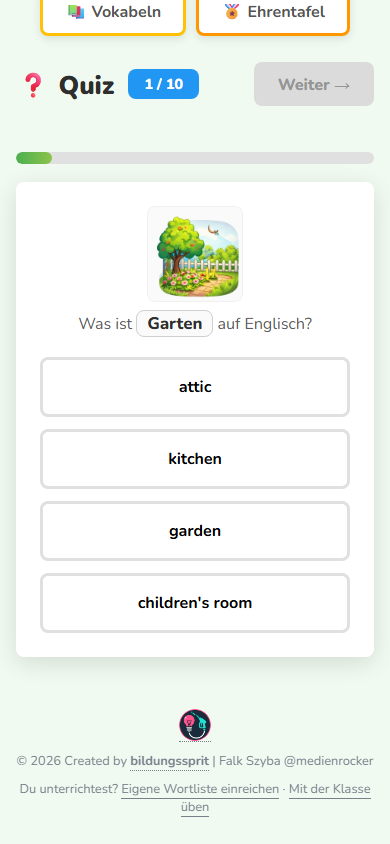

Oben steht, bei welcher Frage du bist, zum Beispiel **1 / 10**.
In der Mitte steht das Wort. Darunter stehen die Antworten.
Tippe die an, die du für richtig hältst.

---

## 6. Wenn du etwas falsch hast

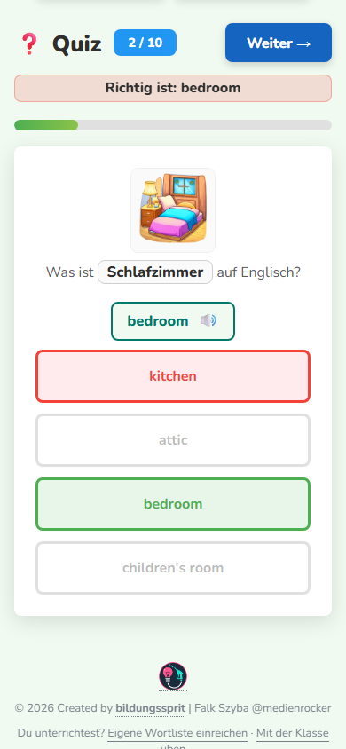

Dann passiert Folgendes:

- Deine Antwort wird **rot**.
- Die richtige Antwort wird **grün**.
- Ganz oben steht **"Richtig ist: ..."**, damit du es sofort siehst.
- Das Bild zum Wort erscheint.

Falsch ist nicht schlimm. wordQUEST merkt sich das Wort und fragt es später
noch einmal. So lernst du es wirklich.

Tippe auf **Weiter →** für die nächste Frage.

---

## 7. Üben, was schwer ist

Tippe auf **Üben**.

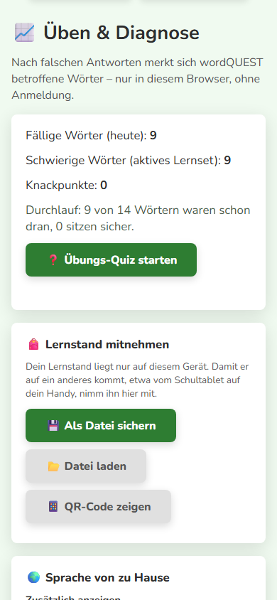

Oben siehst du drei Zahlen:

- **Fällige Wörter**: Die sind heute wieder dran.
- **Schwierige Wörter**: Die gingen zuletzt oft daneben.
- **Knackpunkte**: Die wollen einfach nicht sitzen bleiben.

Mit **Übungs-Quiz starten** übst du genau diese Wörter.
Das ist der schnellste Weg, besser zu werden.

---

## 8. Wenn es zu schwer oder zu eng wird

Scrolle auf der Seite **Üben** weiter nach unten.

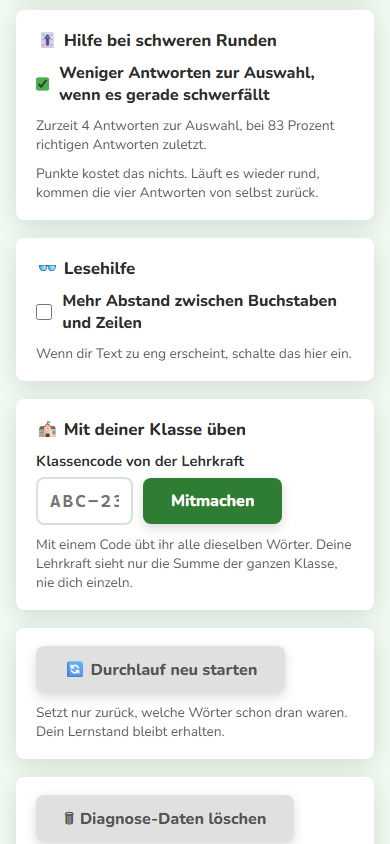

**Hilfe bei schweren Runden**
Wenn eine Runde schlecht läuft, gibt dir wordQUEST weniger Antworten zur
Auswahl. Dann ist es leichter. Punkte kostet dich das nicht.
Sobald es wieder rund läuft, kommen die vier Antworten von selbst zurück.
Du kannst das hier auch ausschalten.

**Lesehilfe**
Wenn dir die Schrift zu eng vorkommt, schalte das hier ein.
Dann stehen die Buchstaben und Zeilen weiter auseinander.

---

## 9. Deine Sprache von zu Hause

Sprichst du zu Hause noch eine andere Sprache? Dann stelle sie unter
**Üben** bei "Sprache von zu Hause" ein.

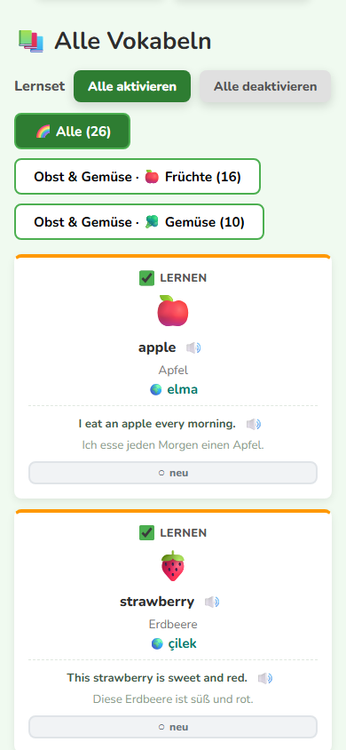

In der Vokabelliste steht dann bei jedem Wort auch deine Sprache dabei,
hier zum Beispiel Türkisch. Das hilft beim Merken.

Nicht jedes Wort hat schon eine Übersetzung. Das wird nach und nach mehr.

---

## 10. Mit deiner Klasse üben

Deine Lehrkraft schreibt vielleicht einen Code an die Tafel,
zum Beispiel **JZT-792**.

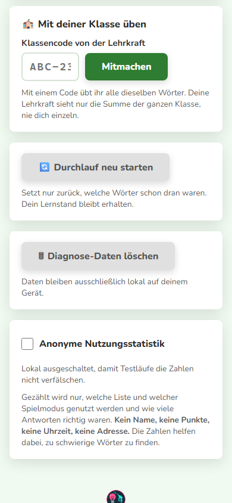

So machst du mit:

1. Tippe auf **Üben**.
2. Scrolle nach unten zu **Mit deiner Klasse üben**.
3. Tippe den Code ein.
4. Tippe auf **Mitmachen**.

Die richtigen Wortlisten stellen sich von selbst ein.

**Wichtig:** Deine Lehrkraft sieht nur, wie die ganze Klasse zusammen
vorankommt. Niemand sieht, was du einzeln gemacht hast. Kein Name,
keine Punkte, keine Uhrzeit.

---

## 11. Lernstand mitnehmen

Du hast in der Schule auf dem Tablet geübt und willst zu Hause am Handy
weitermachen? Das geht.

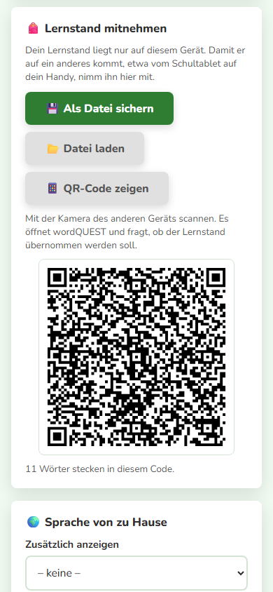

Gehe auf **Üben** und suche **Lernstand mitnehmen**. Du hast zwei Wege:

**Als Datei sichern**
Speichert eine Datei. Die schickst du dir selbst, zum Beispiel per Mail.
Auf dem anderen Gerät tippst du auf **Datei laden**.

**QR-Code zeigen**
Zeigt ein schwarz-weißes Muster. Scanne es mit der Kamera vom anderen
Gerät. wordQUEST öffnet sich dort und fragt, ob es deinen Lernstand
übernehmen soll. Sage ja.

In einen QR-Code passt nicht beliebig viel. Wenn du schon sehr viele Wörter
geübt hast, sagt dir wordQUEST das und du nimmst einfach die Datei.

---

## 12. Die Ehrentafel

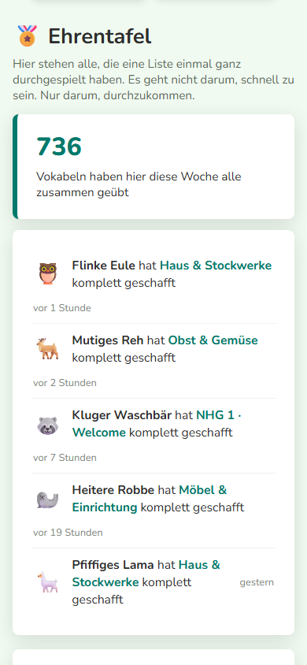

Hier stehen alle, die eine Liste einmal **komplett** durchgespielt haben.

Es geht nicht darum, schnell zu sein. Es geht auch nicht um viele Punkte.
Nur darum, einmal ganz durchzukommen. Das schaffst du.

Auf der Tafel steht nur dein gewürfelter Name und dein Tier.
Sonst nichts. Wenn du gar nicht auf die Tafel willst, schalte es unten
auf der Seite aus.

---

## Kurz gesagt

- Du brauchst kein Konto und gibst keinen Namen ein.
- Falsch ist nicht schlimm, es hilft beim Lernen.
- Du spielst gegen dich selbst, nie gegen andere.
- Alles bleibt auf deinem Gerät.
- Wenn du etwas nicht verstehst: oben auf das **?** tippen.
