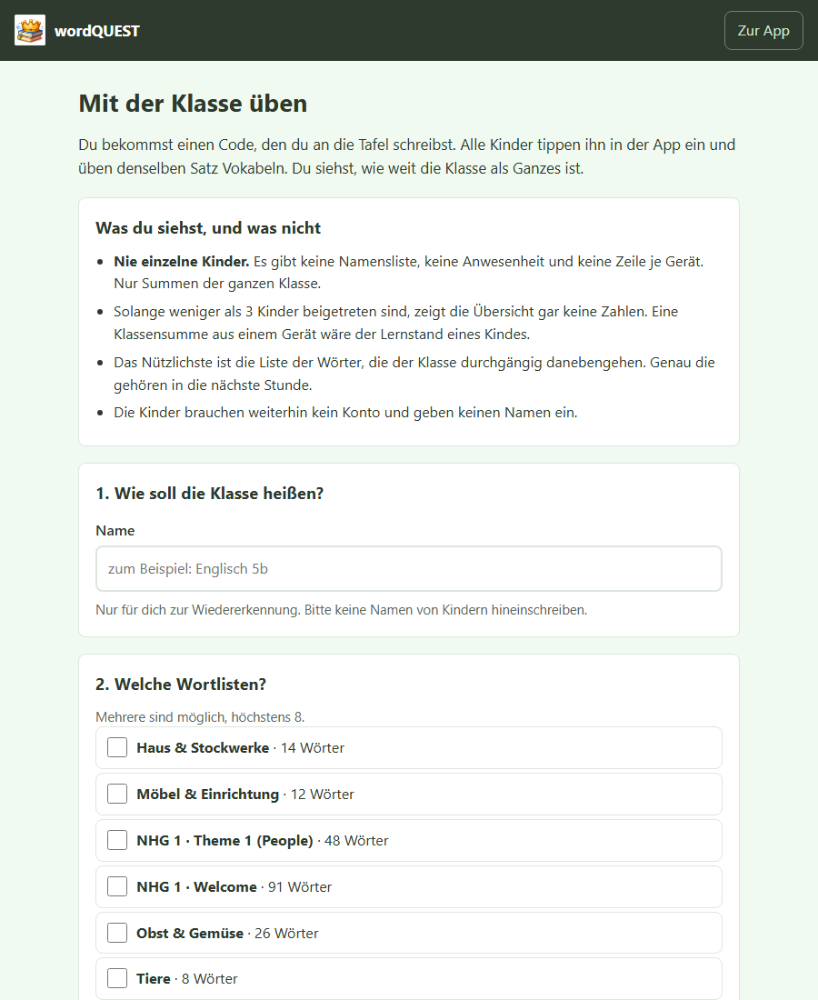
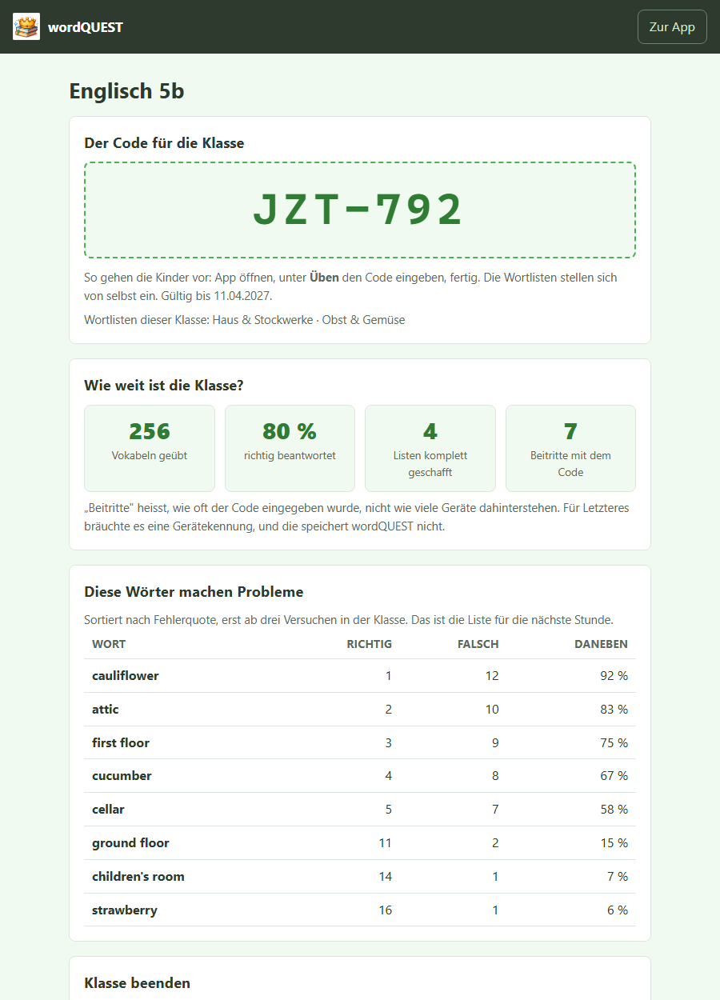
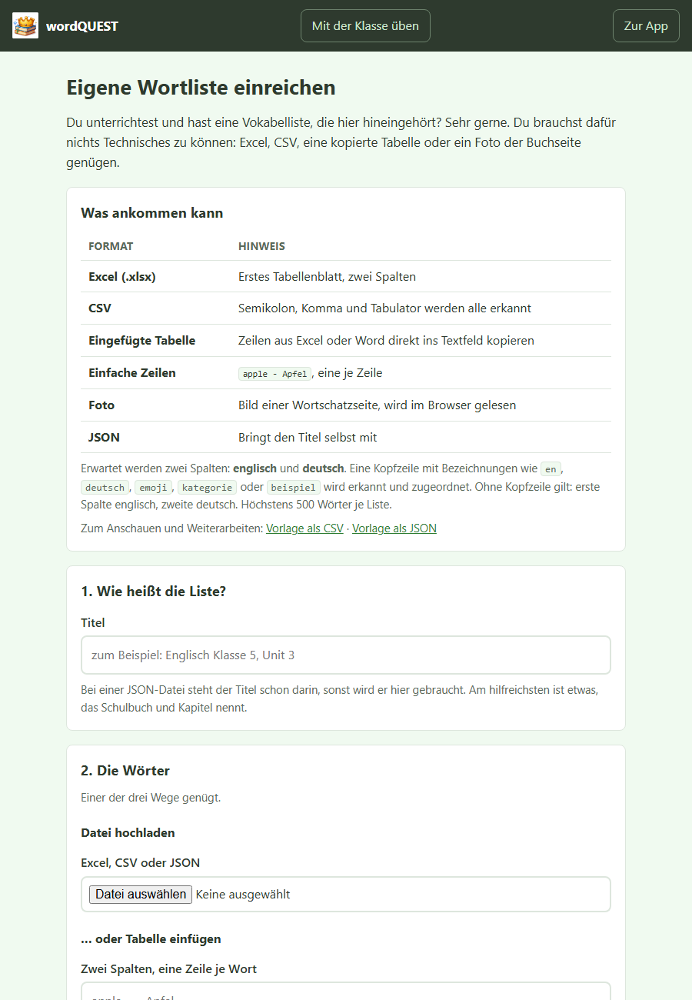
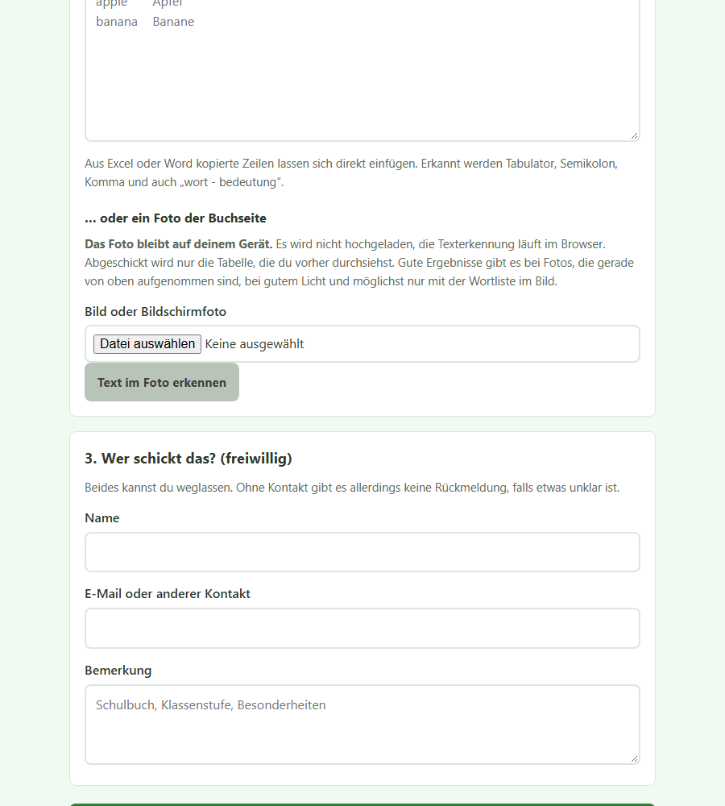

# wordQUEST für Lehrkräfte

Diese Anleitung beschreibt alles, was du ohne Zugangsdaten tun kannst:
eine Klasse anlegen, den Lernstand der Gruppe verfolgen und eigene
Wortlisten einreichen.

**Adresse der App:** wordquest.bildungssprit.de

---

## Das Wichtigste vorweg

**Es gibt kein Lehrkraftkonto.** Du meldest dich nirgends an, es gibt keine
Registrierung und keine Passwörter. Stattdessen legst du eine Klasse an und
bekommst dafür zwei Dinge:

| Was | Für wen | Wofür |
|---|---|---|
| **Ein Code**, zum Beispiel `JZT-792` | für die Kinder | vorlesbar, an die Tafel schreibbar |
| **Ein geheimer Link** | nur für dich | der einzige Weg zurück zu deiner Übersicht |

Der Link ist der Schlüssel. Es gibt kein "Passwort vergessen".
Speichere ihn als Lesezeichen oder schicke ihn dir selbst per Mail.

**Die Kinder brauchen ebenfalls kein Konto.** Sie geben keinen Namen ein.

---

## 1. Eine Klasse anlegen

Rufe **wordquest.bildungssprit.de/klasse.php** auf. Du findest den Weg auch
über den Link "Mit der Klasse üben" ganz unten in der App.

Drei Schritte:

1. **Name der Klasse.** Nur für dich zur Wiedererkennung, zum Beispiel
   "Englisch 5b". Bitte keine Namen von Kindern eintragen.
2. **Wortlisten auswählen.** Mehrere sind möglich, höchstens acht.
   Genau diese Listen stellen sich bei den Kindern später von selbst ein.
3. **Anlegen.**

Danach zeigt dir die Seite einmalig eine Karte mit der Überschrift
**"Bitte diesen Link aufbewahren"** und darunter die vollständige Adresse.
Das ist der Moment, in dem du das Lesezeichen setzt.

Eine Klasse läuft nach 200 Tagen von selbst aus.

---

## 2. Die Kinder holen sich den Code

Schreibe den Code an die Tafel. Die Kinder gehen so vor:

1. wordQUEST öffnen
2. auf **Üben** tippen
3. bis **Mit deiner Klasse üben** scrollen
4. Code eintippen, auf **Mitmachen** tippen

Die Wortlisten stellen sich von selbst ein. Es ist keine Auswahl nötig
und keine Eingabe eines Namens.

---

## 3. Deine Übersicht

Öffne deinen gespeicherten Link.

Du siehst vier Zahlen:

- **Vokabeln geübt**: alle beantworteten Fragen der Klasse zusammen
- **Richtig beantwortet**: die Trefferquote der Gruppe
- **Listen komplett geschafft**: wie oft jemand eine Liste ganz durchgespielt hat
- **Beitritte mit dem Code**: wie oft der Code eingegeben wurde

"Beitritte" ist bewusst nicht dasselbe wie "Anzahl der Kinder". Für eine
Gerätezählung bräuchte es eine Gerätekennung, und die speichert wordQUEST
nicht.

### Die nützlichste Tabelle: "Diese Wörter machen Probleme"

Sortiert nach Fehlerquote, erst ab drei Versuchen in der Klasse.
Genau diese Wörter gehören in die nächste Stunde. Das ist der eigentliche
Gewinn gegenüber einer reinen Vokabelapp.

---

## 4. Was du siehst und was nicht

Das ist keine Nebensache, sondern die Bauweise:

- **Nie einzelne Kinder.** Es gibt keine Namensliste, keine Anwesenheit und
  keine Zeile je Gerät. Nur Summen der ganzen Klasse.
- **Solange weniger als drei Kinder beigetreten sind, zeigt die Übersicht
  gar keine Zahlen.** Eine Klassensumme aus einem Gerät wäre der Lernstand
  eines einzelnen Kindes.
- Keine Uhrzeiten, keine Adressen, keine Punktzahlen einzelner Kinder.

Du kannst das den Eltern so weitergeben.

---

## 5. Klasse beenden

Am Ende der Übersicht stehen zwei Knöpfe:

- **Klasse schließen**: Der Code funktioniert nicht mehr, deine Übersicht
  bleibt erhalten. Das ist der normale Weg am Ende einer Einheit.
- **Klasse löschen**: Klasse und alle Zahlen verschwinden sofort und
  vollständig. Das lässt sich nicht rückgängig machen.

---

## 6. Eigene Wortliste einreichen

Du hast eine Vokabelliste, die hier hineingehört? Rufe
**wordquest.bildungssprit.de/einreichen.php** auf. Du findest den Weg auch
über den Link "Eigene Wortliste einreichen" unten in der App.

Du brauchst nichts Technisches zu können. Möglich sind:

| Format | Hinweis |
|---|---|
| **Excel (.xlsx)** | erstes Tabellenblatt, zwei Spalten |
| **CSV** | Semikolon, Komma und Tabulator werden alle erkannt |
| **Eingefügte Tabelle** | Zeilen aus Excel oder Word direkt ins Textfeld kopieren |
| **Einfache Zeilen** | `apple - Apfel`, eine je Zeile |
| **Foto** | Bild einer Wortschatzseite, wird im Browser gelesen |
| **JSON** | bringt den Titel selbst mit |

Erwartet werden zwei Spalten, englisch und deutsch. Eine Kopfzeile mit
Bezeichnungen wie `en`, `deutsch`, `emoji`, `kategorie` oder `beispiel` wird
erkannt und zugeordnet. Ohne Kopfzeile gilt: erste Spalte englisch, zweite
deutsch. Höchstens 500 Wörter je Liste.

Auf der Seite stehen außerdem eine Vorlage als CSV und eine als JSON
zum Herunterladen.

### Der Weg über ein Foto

**Das Foto bleibt auf deinem Gerät.** Es wird nicht hochgeladen, die
Texterkennung läuft im Browser. Abgeschickt wird nur die Tabelle, die du
vorher durchsiehst und korrigierst.

Gute Ergebnisse gibt es bei Fotos, die gerade von oben aufgenommen sind, bei
gutem Licht und möglichst nur mit der Wortliste im Bild. Handschrift wird
nicht erkannt, Lautschrift wird automatisch aussortiert.

Die Erkennung macht Fehler, das ist normal. Sieh jede Zeile durch, entferne
falsche und korrigiere den Rest. Erst dann übernehmen.

### Was danach passiert

Nichts wird sofort sichtbar. Jede Einreichung landet zuerst in einer
Warteschlange und erscheint erst nach der Freigabe durch die Betreuung in
der App.

Name und Kontakt sind freiwillig. Ohne Kontakt gibt es allerdings keine
Rückmeldung, falls etwas unklar ist.

---

## 7. Was wordQUEST im Unterricht gut kann

- **Einstieg ohne Hürde.** Kein Konto, keine Installation, keine Lizenz.
  Ein Link genügt, auch auf alten Android-Geräten.
- **Offline.** Einmal geöffnet, läuft die App ohne Internet weiter.
  Das hilft bei schlechtem WLAN und bei Kindern ohne Datenvolumen.
- **Selbstanpassung.** Läuft eine Runde schlecht, stehen weniger Antworten
  zur Auswahl. Die Aufgabe bleibt dieselbe, nur das Raten wird leichter.
  Punkte kostet es nicht, und angesagt wird es dem Kind auch nicht.
- **Kein Wettbewerb.** Es gibt keine Rangliste. Die Ehrentafel nennt nur,
  wer eine Liste einmal ganz geschafft hat, unabhängig von Tempo und Punkten.
  Damit ist sie für jedes Kind erreichbar.
- **Sprachbrücke.** Kinder können eine Familiensprache dazuschalten.
  Die Vokabelliste zeigt dann eine dritte Zeile je Wort.
- **Lernstand mitnehmen.** Vom Schultablet aufs eigene Handy per Datei oder
  QR-Code, ohne Konto und ohne Server.

---

## Kurz gesagt

1. Klasse unter `/klasse.php` anlegen, **Link als Lesezeichen sichern**.
2. Code an die Tafel, Kinder tippen ihn unter **Üben** ein.
3. Übersicht über deinen Link öffnen, Tabelle "Diese Wörter machen Probleme"
   für die nächste Stunde nutzen.
4. Eigene Listen unter `/einreichen.php` abgeben, auch als Foto.
